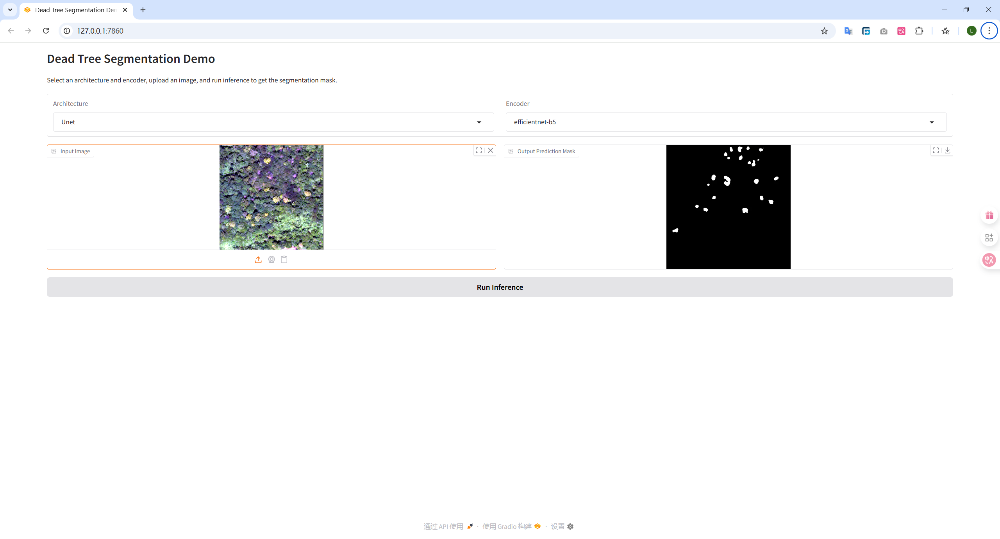

# **COMP9517 Computer Vision 25T2 Group Project**

The goal of this group project is to develop and compare different deep learning computer vision methods for the semantic segmentation of dead trees in aerial images. The dataset used for this project is [](https://www.kaggle.com/datasets/meteahishali/aerial-imagery-for-standing-dead-tree-segmentation), which contains RGB and NRG (NIR-RG) images.

This project is implemented using [](https://pytorch.org) and [](https://lightning.ai/docs/pytorch/stable/), and it includes over 60+ deep learning methods for semantic segmentation powered by [](https://github.com/qubvel-org/segmentation_models.pytorch). And, we also try zero-shot and fine-tuning with [](https://github.com/facebookresearch/sam2) .

The software demonstration [](https://www.gradio.app/).

**Table of contents:**
- [**COMP9517 Computer Vision 25T2 Group Project**](#comp9517-computer-vision-25t2-group-project)
  - [**0. Project Zotero Library**](#0-project-zotero-library)
  - [**1. Project Files Structure**](#1-project-files-structure)
  - [**2. Setup Environment Instructions**](#2-setup-environment-instructions)
    - [2.1 Clone the repository](#21-clone-the-repository)
    - [2.2 Set up environment](#22-set-up-environment)
      - [2.2.1 Setup Environment with Conda](#221-setup-environment-with-conda)
      - [2.2.2 Setup for SAM2 (Optional)](#222-setup-for-sam2-optional)
    - [2.3 **Activate the environment**](#23-activate-the-environment)
  - [**3. Project Methods**](#3-project-methods)
    - [3.1 SMP (Segmentation Models PyTorch)](#31-smp-segmentation-models-pytorch)
      - [Applied Architectures](#applied-architectures)
      - [Applied Feature Extractors (Encoders)](#applied-feature-extractors-encoders)
    - [3.2 SAM2 （Zero-Shot Segmentation \& Fine-Tuning）](#32-sam2-zero-shot-segmentation--fine-tuning)
  - [**4. Training \& Testing**](#4-training--testing)
    - [4.1 Dataset \& Pre-trained Weights](#41-dataset--pre-trained-weights)
    - [4.2 Training](#42-training)
      - [4.2.1 SMP (Segmentation Models PyTorch)](#421-smp-segmentation-models-pytorch)
      - [4.2.2 SAM2 (Fine-Tuning)](#422-sam2-fine-tuning)
    - [4.3 Testing](#43-testing)
      - [4.3.1 SMP (Segmentation Models PyTorch)](#431-smp-segmentation-models-pytorch)
      - [4.3.2 SAM2 (Zero-Shot Segmentation \& Fine-Tuning)](#432-sam2-zero-shot-segmentation--fine-tuning)
  - [**5. Experimental Results**](#5-experimental-results)
    - [5.1 Metrics Description](#51-metrics-description)
    - [5.2 Modality Mean Metrics (SMP)](#52-modality-mean-metrics-smp)
    - [5.3 Results Summary of Different Architectures](#53-results-summary-of-different-architectures)
    - [5.4 Results Summary of Different Feature Extractors (Encoders/Backbones)](#54-results-summary-of-different-feature-extractors-encodersbackbones)
  - [**6. Gradio Demo**](#6-gradio-demo)
  - [**7. Future Work**](#7-future-work)


## **0. Project Zotero Library**

This project has a Zotero library that contains references to papers, articles, and other resources relevant to the project. You can access the Zotero library at the following link:

[https://www.zotero.org/groups/6056458/cvers](https://www.zotero.org/groups/6056458/cvers)

## **1. Project Files Structure**

This project is organized into several directories and files, each serving a specific purpose. Below is an overview of the project structure:

```plaintext
CV9517_Group-Project/
├── checkpoints/                 # Directory for model checkpoints (Local storage)
├── data/                        # Directory for data processing scripts
│   ├── __init__.py              # Init file for data processing module
│   ├── datamodule.py            # Script for lightning datamodule (Supports merged, RGB, and NRG modalities)
│   ├── dataset.py               # Script for dataset class
│   ├── transforms.py            # Script for data transformations
│   └── utils.py                 # Utility functions for data processing
├── datasplits                   # Directory for data splits csv files
│   └── data_split_42_70_10.csv  # seed 42, train 70%, val 10%, test 20%
├── gradio/                      # Directory for Gradio app script
│   └── app.py                   # Script for Gradio app (RGB modality only for now)
├── lighting_modules             # Directory for lightning modules
│   ├── __init__.py              # Init file for lightning modules
│   ├── sam2_module              # Script for SAM2 lightning module (Future work)
│   ├── segmentation_module      # Base lightning module for this dead tree segmentation project
│   ├── smp_module               # Script for Segmentation Models PyTorch lightning module
│   └── u2net_module             # Script for U2Net lightning module
├── logs/                        # Directory for logs (Local storage, e.g., TensorBoard logs)
├── models/                      # Directory for model scripts
│   ├── __init__.py              # Init file for models module
│   ├── smp_models_util.py       # Utility functions for models of Segmentation Models PyTorch
│   └── u2net.py                 # Script for U2Net model for semantic segmentation
├── notebooks/                   # Directory for Jupyter notebooks (It is for simple demonstration and testing)
│   └─ segmentation_models.ipynb # Notebook for testing Segmentation Models PyTorch
├── outputs/                     # Directory for output files (e.g., model predictions, evaluation logs)
├── sam2/                        # Directory for SAM2 (You should clone files from the SAM2 official GitHub repository)
├── scripts/                     # Directory for scripts
│   ├── sam2_fine_tune.py        # Script for fine-tuning SAM2 model
│   ├── sam2_ft_lightning.py     # Script for fine-tuning SAM2 model using PyTorch Lightning (Future work)
│   ├── sam2_inference_vis.py    # Script for inference using SAM2 model (Visualize the results)
│   ├── sam2_zero_shot.py        # Script for test zero-shot segmentation using SAM2
│   ├── test_sam2_ft.py          # Script for testing fine-tuned SAM2 model
│   ├── test_smp.py              # Script for testing Segmentation Models PyTorch model
│   ├── train_smp.py             # Script for training Segmentation Models PyTorch model (Over 60 models, with different architectures & feature extractors, on 3 modalities)
│   └── train_u2net.py           # Script for training U2Net model (Future work)
├── utils/                       # Directory for utility scripts
│   ├── __init__.py              # Init file for utils module
│   ├── callbacks.py             # Script for abstracting lightning trainer callbacks
│   ├── logger.py                # Script for abstracting logger construction for each kind of activity
│   └── paths.py                 # Script for paths management
├── .gitignore                   # Git ignore file to exclude unnecessary files from version control
├── environment.yaml             # Conda environment file for dependencies
├── README.md                    # Project overview and instructions
└── requirements.txt             # Pip requirements file
```

---

## **2. Setup Environment Instructions**

### 2.1 Clone the repository

   ```bash
   git clone https://github.com/ParzHe/CV9517_Group-Project.git
   cd CV9517_Group-Project
   ```

### 2.2 Set up environment

We suggest you to use Linux for the trying. If you are using Windows, we suggest you use [WSL](https://learn.microsoft.com/en-us/windows/wsl/install) (Windows Subsystem for Linux).

If you do not have `conda` installed, you can install it from the [Anaconda website](https://www.anaconda.com/download).

#### 2.2.1 Setup Environment with Conda

- Create a `CVers` conda environment using the provided `environment.yaml` file:

   ```shell
   # in the root directory of the project
   conda env create -f ./environment.yaml
   ```

- Activate the `CVers` environment:

   ```shell
   conda activate CVers
   ```

#### 2.2.2 Setup for SAM2 (Optional)
- Install `sam2`:

   ```shell
   git clone https://github.com/facebookresearch/sam2.git && cd sam2

   pip install -e .

   ```

- Download the SAM2 model weights with the following command:

   ```shell
   cd sam2/checkpoints
   bash download_ckpts.sh
   ```

- Then back to the root directory of the project:

   ```shell
   cd ../..
   ```

### 2.3 **Activate the environment**

Our environment can be activated using the following commands:

   ```shell
   conda activate CVers # For the Pytorch Lightning environment.
   ```
---

## **3. Project Methods**

### 3.1 SMP (Segmentation Models PyTorch)

**Person in Charge**: [Lintao He 何林涛](https://github.com/ParzHe)

**Participants (listed in alphabetical order by name)**: [Bowei Cheng 程柏威](https://github.com/Awzhcc), [Chencan Que 阙晨灿](https://github.com/IkarosForever), [Zhen Yang 杨震](https://github.com/DravenYiZ), [Zitong Wei 魏子童](https://github.com/WIZ-ROC)

You can find the papers by directly clicking the architecture and feature extractor names below.

#### Applied Architectures

- **[Unet](https://link.springer.com/chapter/10.1007/978-3-319-24574-4_28)**
- **[Unet++](https://link.springer.com/chapter/10.1007/978-3-030-00889-5_1)**: Do not support `Mix Vision Transformer (MixViT)` as the feature extractor (encoder).
- **[Linknet](https://ieeexplore.ieee.org/document/8305148)**: Do not support `Mix Vision Transformer (MixViT)` as the feature extractor (encoder).
- **[FPN](https://ieeexplore.ieee.org/document/8099589)**
- **[PSPNet](https://ieeexplore.ieee.org/document/8100143)**
- **[PAN](https://arxiv.org/abs/1805.10180)**: Do not support `DenseNet` as the feature extractor (encoder).
- **[DeepLabV3](https://arxiv.org/abs/1706.05587)**: Do not support `DenseNet` as the feature extractor (encoder).
- **[DeepLabV3+](https://link.springer.com/chapter/10.1007/978-3-030-01234-2_49)**: Do not support `DenseNet` as the feature extractor (encoder).
- **[UperNet](https://link.springer.com/chapter/10.1007/978-3-030-01228-1_26)**
- **[SegFormer](https://proceedings.neurips.cc/paper/2021/hash/64f1f27bf1b4ec22924fd0acb550c235-Abstract.html)**

#### Applied Feature Extractors (Encoders)

Select the following feature extractors (encoders) because they have close parameters.

- **[DenseNet161](https://ieeexplore.ieee.org/document/8099726)**: Do not support  `DeepLabV3`, `DeepLabV3+` and `PAN` architectures.
- **[EfficientNet-B5](https://proceedings.mlr.press/v97/tan19a.html?ref=%2A%2Aa-ai-gmbh.ghost.io)**
- **[Mix Vision Transformer (MixViT)](https://www.sciencedirect.com/science/article/pii/S0031320322006112)**: Do not support `Unet++` and `Linknet` architectures.
- **[ResNet50](https://ieeexplore.ieee.org/document/7780459)**
- **[ResNeXt50_32x4d](https://ieeexplore.ieee.org/document/8100117)**
- **[SE-ResNet50 and SE-ResNeXt50_32x4d](https://ieeexplore.ieee.org/document/8578843)**

### 3.2 SAM2 （Zero-Shot Segmentation & Fine-Tuning）

**Person in Charge**: [Zhen Yang（杨震）](https://github.com/DravenYiZ)

**Participant**: [Lintao He 何林涛](https://github.com/ParzHe)

Refer to:

1. The [GitHub repository](https://github.com/facebookresearch/sam2)
2. [Enabling Meta’s SAM 2 model for Geospatial AI on satellite imagery](https://wherobots.com/blog/sam-2-model-geospatial-ai-satellite-imagery/)
3. [axXiv paper](https://arxiv.org/abs/2503.07266): "Customized SAM 2 for Referring Remote Sensing Image Segmentation"
4. [axXiv paper](https://arxiv.org/abs/2506.03114): "Zero-Shot Tree Detection and Segmentation from Aerial Forest Imagery"

Dev Environment: `CVers` or other environments as needed 

> [!NOTE]
> You need to manually clone the SAM2 repository and download the model weights as described in [2.2.2 Subsection](#222-setup-for-sam2-optional).

## **4. Training & Testing**

### 4.1 Dataset & Pre-trained Weights

The code will automatically download the dataset from Kaggle, with the `kagglehub` package. If you want to delete the dataset, you need to go to the `.cache/kagglehub/datasets` directory. And, the datasplit csv files are stored in the `datasplits` directory. You can set different seeds and split ratios by modifying the parameters of `AerialDeadTreeSegDataModule` in different training or test scripts.

For Segmentation Models PyTorch, the pre-trained weights will be automatically downloaded. If you want to delete the pre-trained weights, you need to go to the `~/.cache/huggingface/hub` directory to delete as you wish.

For SAM2, the pre-trained weights should download manually as described in the [2.2.2 Subsection](#222-setup-for-sam2-optional).

### 4.2 Training

#### 4.2.1 SMP (Segmentation Models PyTorch)

To train the Segmentation Models PyTorch, you can use the following command in the root directory of the project:

```bash
conda activate CVers  # Activate the CVers environment
python scripts/train_smp.py
```

This will train all the architectures and feature extractors specified in the `arch_list` and `encoder_only` variables in the `scripts/train_smp.py` file. The training will be performed on the merged, RGB and NRG modalities by default.

> [!TIP]
> You can modify the `BATCH_SIZE` and `ACCUMULATE_GRAD_BATCHES` variables in the `scripts/train_smp.py` file to adjust the batch size and gradient accumulation. The default values are `BATCH_SIZE = 32` and `ACCUMULATE_GRAD_BATCHES = 1`. If you encounter out-of-memory (OOM) errors, you can try reducing the batch size and increasing the gradient accumulation.

**4.2.1.1 Train on a specific architecture or feature extractor:**

If you want to train a specific architecture or feature extractor, you can modify the `arch_list` and `encoder_only` variables in the `scripts/train_smp.py` file. For example, to train the `Unet` architecture with `DenseNet161` as the feature extractor, you can set:

```python
arch_list = ['Unet']
encoder_only = ['densenet161']
```

**4.2.1.2 Train on a specific modality:**

If you want to train on a specific modality, you can modify the `modality_list` variable in the `scripts/train_smp.py` file. For example, to train only on the RGB modality, you can set:

```python
modality_list = ['rgb']
```

**4.2.1.3 Loss Function:**

The default loss function is combination of `JaccardLoss` and `FocalLoss`. You can modify the loss function in the `scripts/train_smp.py` file by changing the `LOSS1` and `LOSS2` variables. For example, to use only `JaccardLoss`, you can set:

```python
LOSS1 = 'JaccardLoss'
LOSS2 = None
```

**4.2.1.4 Early Stopping:**

The training script will automatically stop if the validation loss does not improve for 30 epochs. This can avoid overfitting and save training time. You can modify the `EARLY_STOP_PATIENCE` variable in the `scripts/train_smp.py` file to change the patience value.

**4.2.1.5 Checkpoints Saving:**
The training script will automatically save the best 2 model checkpoints in the `checkpoints/` directory, each models have 3 modalities (merged, RGB, NRG) folders to save the checkpoints. The checkpoints will be saved with the following naming format:

```plaintext
smp_{encoder}_{arch}/{modality}_{target size}_{version suffix}/{epoch}-{val per_image_mIou}.ckpt
```

Where:
- `{encoder}`: The feature extractor (encoder) name.
- `{arch}`: The architecture name.
- `{modality}`: The modality name (merged, rgb, nrg).
- `{target size}`: The target size of the input images.
- `{version suffix}`: The version suffix, can be changed as needed.
- `{epoch}`: The epoch number of the saving model.
- `{val per_image_mIou}`: The validation imagewise mean Intersection over Union (mIoU) value.


>[!NOTE]
> 1. The training script will automatically search the suggested learning rate using the `find_lr` method from the `lightning` library.
> 2. The training script will automatically log the training and validation metrics to the `logs/` directory, which can be viewed using TensorBoard. And, logging summary will also be done in the certain `checkpoints/` directory.

#### 4.2.2 SAM2 (Fine-Tuning)
To fine-tune the SAM2 model, you can use the following command in the root directory of the project:

```bash
conda activate CVers  # Activate the CVers environment
python scripts/sam2_fine_tune.py
```

### 4.3 Testing

#### 4.3.1 SMP (Segmentation Models PyTorch)

To test the Segmentation Models PyTorch, you can use the following command:

```bash
conda activate CVers  # Activate the CVers environment
python scripts/test_smp.py
```

This script will automatically load the best model checkpoints from the `checkpoints/` directory and perform inference on the test dataset split with the specified split and modality. The results will generate a csv file in the `outputs/smp_test_results` directory.

#### 4.3.2 SAM2 (Zero-Shot Segmentation & Fine-Tuning)

**4.3.2.1 Zero-Shot Segmentation**

For zero-shot segmentation using SAM2, you can use the following command:

```bash
conda activate CVers  # Activate the CVers environment
python scripts/sam2_zero_shot.py
```

This script will perform zero-shot segmentation using the SAM2 model on the test dataset split. The results will be saved in the `outputs/sam2_zs_inference` directory.

**4.3.2.2 Fine-Tuning Test**

For fine-tuning the SAM2 model, you can use the following command:

```bash
conda activate CVers  # Activate the CVers environment
python scripts/test_sam2_ft.py
```

This script will load the fine-tuned SAM2 model and perform inference on the test dataset split. The results will be saved in the `outputs/sam2_ft_inference` directory.

## **5. Experimental Results**

### 5.1 Metrics Description

- Per Image IoU: Image-by-image calculation IoU and then average
- Dataset IoU: IoU calculated on the whole dataset
- F1 Score: Harmonic mean of precision and recall
- F2 Score: Harmonic mean of precision and recall with more emphasis on recall
- Accuracy: Ratio of correct pixel predictions to the total predictions
- Precision: Ratio of true positive predictions to the total predicted positives
- Recall: Ratio of true positive predictions to the total actual positives
- Sensitivity: True positive rate, same as recall
- Specificity: True negative rate, ratio of true negative predictions to the total actual negatives
- Test Time (Seconds): Time taken to perform inference on the test dataset

### 5.2 Modality Mean Metrics (SMP)

| Metric        | RGB-NIR | NIR-RG | RGB    |
| ------------- | ------- | ------ | ------ |
| Per Image IoU | 0.4481  | 0.4290 | 0.4334 |
| Dataset IoU   | 0.4605  | 0.4379 | 0.4472 |
| F1 Score      | 0.6020  | 0.5847 | 0.5847 |
| F2 Score      | 0.6089  | 0.5938 | 0.5898 |
| Accuracy      | 0.9839  | 0.9830 | 0.9836 |
| Precision     | 0.6342  | 0.6139 | 0.6239 |
| Recall        | 0.6235  | 0.6107 | 0.6038 |
| Sensitivity   | 0.6235  | 0.6107 | 0.6038 |
| Specificity   | 0.9922  | 0.9918 | 0.9924 |

The result is the mean of all the architectures and feature extractors tested on the RGB-NIR, NIR-RG, and RGB modalities.

### 5.3 Results Summary of Different Architectures

<table>
  <thead>
    <tr>
      <th rowspan="2">Architecture</th>
      <th colspan="2">Per Image IoU</th>
      <th colspan="2">Dataset IoU</th>
      <th colspan="2">Test Time (Seconds)</th>
    </tr>
    <tr>
      <th>mean</th><th>max</th>
      <th>mean</th><th>max</th>
      <th>mean</th><th>max</th>
    </tr>
  </thead>
  <tbody>
    <tr><td>DeepLabV3</td><td>0.4216</td><td>0.4505</td><td>0.4358</td><td>0.4602</td><td>3.0977</td><td>5.7786</td></tr>
    <tr><td>DeepLabV3Plus</td><td>0.4199</td><td>0.4528</td><td>0.4324</td><td>0.4655</td><td>2.5329</td><td>3.7419</td></tr>
    <tr><td>FPN</td><td>0.4469</td><td>0.4759</td><td>0.4562</td><td>0.4911</td><td>2.7698</td><td>3.8235</td></tr>
    <tr><td>Linknet</td><td>0.4272</td><td>0.4719</td><td>0.4400</td><td>0.4861</td><td>2.8194</td><td>4.2640</td></tr>
    <tr><td>PAN</td><td>0.4427</td><td>0.4624</td><td>0.4538</td><td>0.4762</td><td>4.9664</td><td>37.4820</td></tr>
    <tr><td>PSPNet</td><td>0.4202</td><td>0.4410</td><td>0.4369</td><td>0.4580</td><td>1.8923</td><td>3.0223</td></tr>
    <tr><td>Segformer</td><td>0.4409</td><td>0.4630</td><td>0.4525</td><td>0.4802</td><td>2.6860</td><td>4.1915</td></tr>
    <tr><td>UPerNet</td><td>0.4488</td><td>0.4742</td><td>0.4577</td><td>0.4812</td><td>2.8821</td><td>4.2409</td></tr>
    <tr><td>Unet</td><td>0.4400</td><td>0.4810</td><td>0.4503</td><td>0.4930</td><td>2.8149</td><td>3.8503</td></tr>
    <tr><td>Unet++</td><td>0.4497</td><td>0.4807</td><td>0.4587</td><td>0.4970</td><td>3.5455</td><td>5.4500</td></tr>
    <tr><td>Unet with scse</td><td>0.4441</td><td>0.4790</td><td>0.4567</td><td>0.4959</td><td>3.1273</td><td>4.1764</td></tr>
  </tbody>
</table>

The result is the mean of all the feature extractors with all three modalities tested on the different architectures. The `Unet with scse` architecture is a modified version of the `Unet` architecture with Squeeze-and-Excitation (SE) blocks on decoder.

### 5.4 Results Summary of Different Feature Extractors (Encoders/Backbones)

<table>
  <thead>
    <tr>
      <th rowspan="2">Backbone</th>
      <th colspan="2">Per Image IoU</th>
      <th colspan="2">Dataset IoU</th>
      <th colspan="2">Test Time (Seconds)</th>
    </tr>
    <tr>
      <th>mean</th><th>max</th>
      <th>mean</th><th>max</th>
      <th>mean</th><th>max</th>
    </tr>
  </thead>
  <tbody>
    <tr><td>Densenet-161</td><td>0.4292</td><td>0.4546</td><td>0.4391</td><td>0.4745</td><td>3.7932</td><td>5.4500</td></tr>
    <tr><td>EfficientNet-b5</td><td>0.4521</td><td>0.4810</td><td>0.4658</td><td>0.4970</td><td>4.8207</td><td>37.4820</td></tr>
    <tr><td>MixViT-b2</td><td>0.4354</td><td>0.4759</td><td>0.4442</td><td>0.4911</td><td>3.1613</td><td>5.7786</td></tr>
    <tr><td>Resnet50</td><td>0.4243</td><td>0.4580</td><td>0.4366</td><td>0.4762</td><td>2.1381</td><td>3.1704</td></tr>
    <tr><td>ResneXt50_32x4d</td><td>0.4320</td><td>0.4696</td><td>0.4427</td><td>0.4794</td><td>2.3084</td><td>9.5732</td></tr>
    <tr><td>SE-Resnet50</td><td>0.4397</td><td>0.4781</td><td>0.4532</td><td>0.4835</td><td>2.4685</td><td>3.2726</td></tr>
    <tr><td>SE-ResneXt50_32x4d</td><td>0.4428</td><td>0.4686</td><td>0.4549</td><td>0.4812</td><td>2.4627</td><td>3.2390</td></tr>
  </tbody>
</table>

The result is the mean of all the architectures with all three modalities tested on the different feature extractors. The `MixViT-b2` is a modified version of the `Mix Vision Transformer (MixViT)` with a smaller size.

## **6. Gradio Demo**

To run the Gradio demo, you can use the following command:

```bash
conda activate CVers  # Activate the CVers environment
python gradio/app.py
```

Then, you can open your web browser and go to `http://localhost:7860` to see the demo. The demo will allow you to upload an image and perform inference using the Segmentation Models Pytorch (SMP) models (SAM2 in the future work). The results will be displayed on the web page as following:



>[!NOTE]
> 1. The Gradio demo is only supported for use local checkpoints, so you need to run the `scripts/train_smp.py` script to train the models and save the checkpoints in the `checkpoints/` directory before running the Gradio demo.
> 2. The Gradio demo currently only supports the RGB modality. So, you need to use the RGB images from the dataset. The NRG and merged modalities will be supported in the future work.

## **7. Future Work**

We plan to implement the following features in the future:

- **More Models**: We will add more models to the project, including U2Net and other segmentation models. This will help us to compare the performance of different models on the same dataset.
- **SAM2 zero-shot with prompt**: We will explore the use of prompt techniques to improve the zero-shot segmentation capabilities of the SAM2 model in this task.
- **Different Loss Functions**: We will experiment with different loss functions to improve the performance of the models. This includes trying out different combinations of loss functions and hyperparameters.
